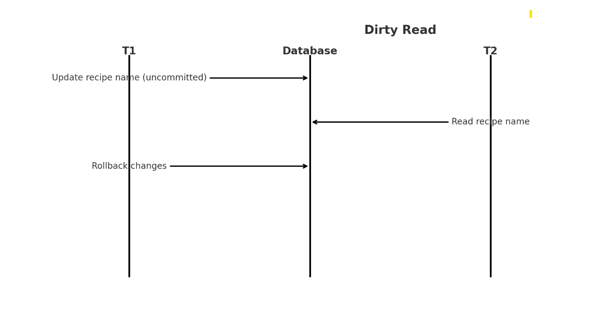

# Concurrency Phenomena and Solutions

## Case 1: Dirty Read
**Scenario:**  
An example of a Dirty Read would be if Transaction A updates a recipe's name in the database but has not committed yet. Transaction B reads the recipe's name before Transaction A commits or rolls back. An Example of this would be like changing Grandma's Banana Bread to just Banana Bread, that update not being complete, someone else reading that name, but then that Transaction of the name change being rolled back. 

**Sequence Diagram:**  

**Impact:**  
If Transaction A rolls back, Transaction B would then be operating on invalid data, Someone would have the idea that the recipe name is Banana Bread when in reality it is still Grandma's Banana Bread. 

**Solution:**  
Use the **Read Committed** isolation level to ensure that Transaction B only sees committed data. This prevents dirty reads by delaying Transaction B until Transaction A commits or rolls back.

## Case 2: Non-Repeatable Read
**Scenario:**  
An example of a non-repeatable read would be if Customer A adds a tub of ice cream and a pack of graham crackers to their cart, with Transaction 1 reading their prices at $5 each. Customer A goes to checkout, however, just before checkout, Transaction 2 updates the price of ice cream to $6 per tub.

**Sequence Diagram:**  

**Impact:**  
Customer A is charged $11 (instead of $10), and they are now in debt.

**Solution:**  
Use the **Repeatable Read** isolation level to ensure that reads within the same transaction will always return the same result within the transaction (meaning that since the ice cream was added to the cart at $5, it will remain that price within the context of that transaction until checkout).

---

## Implementation Notes
In our system, we will apply isolation levels at the database level using the following strategies:

1. **Read Committed** for queries like reading recipe details to avoid dirty reads.
2. **Repeatable Read** for queries like adding items to a cart to avoid non-repeatable reads.

## Ensuring Isolation of Transactions

To ensure isolation and lower the potential of example issues like laid out in the above section we would implement the  following strategies:

### Case 1: Dirty Read
- **Strategy:** Use the **Read Committed** isolation level for transactions that involve reading data.
- **Why this is appropriate:** The Read Committed isolation level ensures that a transaction cannot read data that has been modified but not yet committed by another transaction. This prevents the use of uncommitted ("dirty") data.
### Case 2: Non-Repeatable Read
- **Strategy:** Use the **Repeatable Read** isolation level for transactions that involve multiple reads of the same data within a transaction.
- **Why this is appropriate:** The Repeatable Read isolation level ensures that any data read during the transaction remains consistent, even if other transactions modify the data. This prevents non-repeatable reads by using a snapshot of the data at the start of the transaction. 

